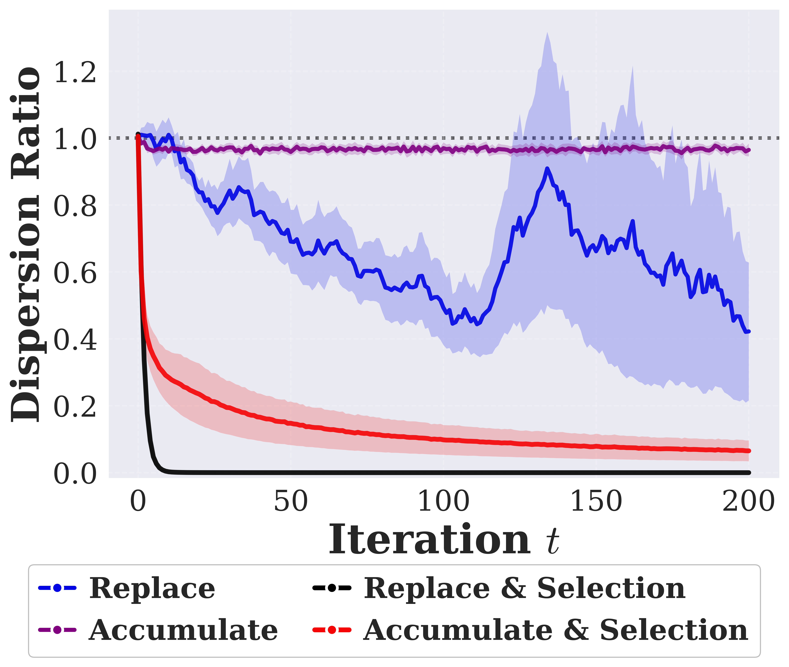
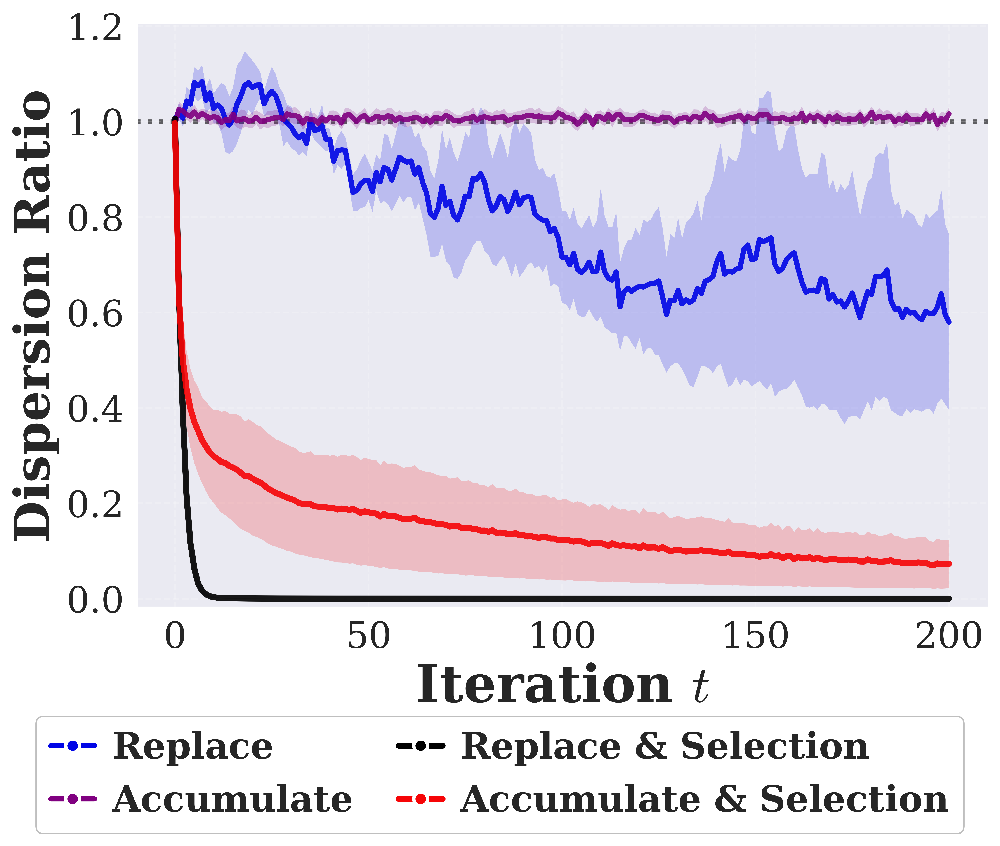
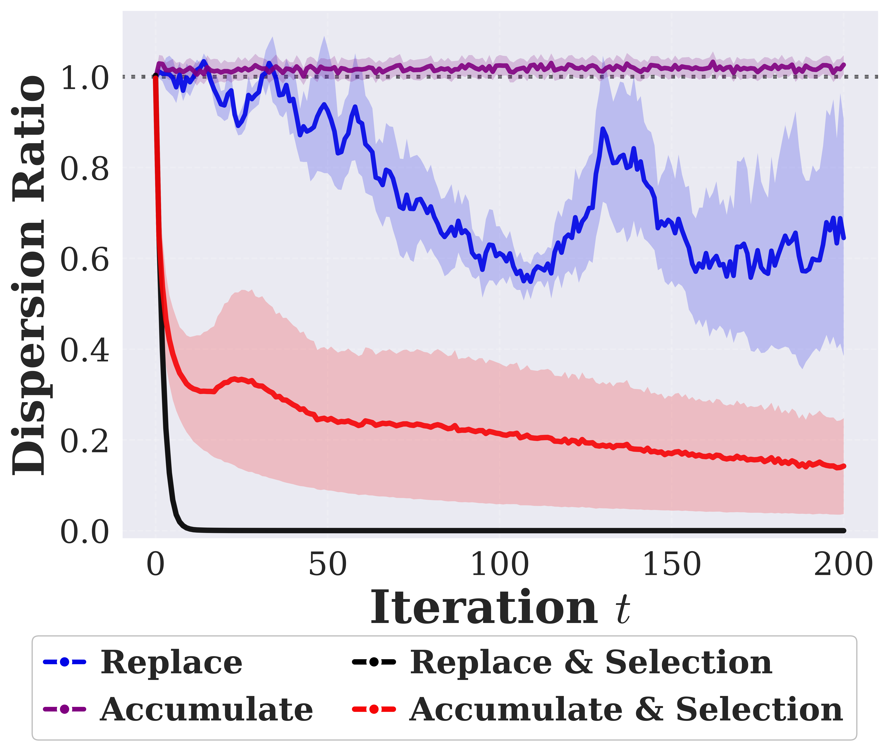
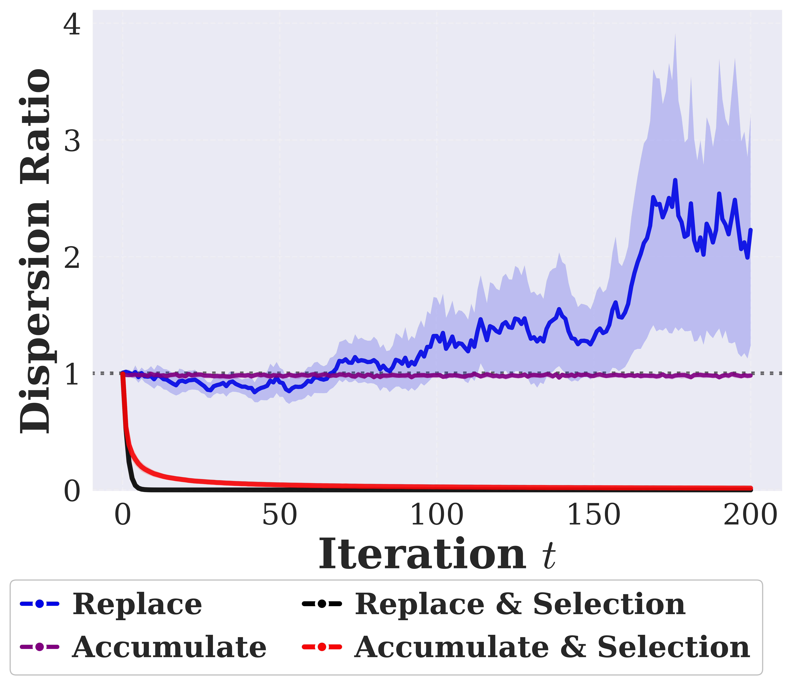
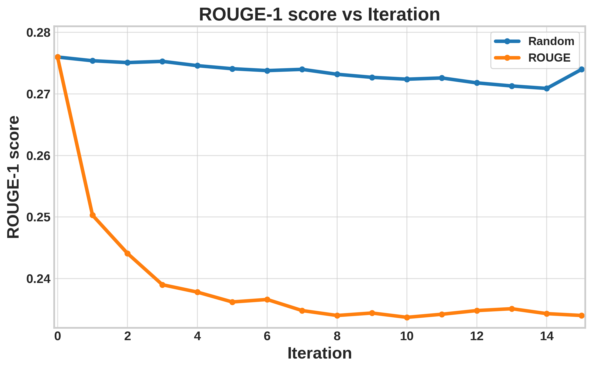

# Rebuttal Navigation

- [Reviewer h5Ke](https://openreview.net/forum?id=FFXvnzM254&noteId=TeAn8zXMan): see [Section for Reviewer h5Ke](#section-for-reviewer-h5ke)
- [Reviewer pAu7](https://openreview.net/forum?id=FFXvnzM254&noteId=OLScpgg2Gs): see [Section for Reviewer pAu7](#section-for-reviewer-pau7)

---

## Section for Reviewer h5Ke

- [1. Non-Gaussian Empirical Evidence](#1-non-gaussian-empirical-evidence)
- [2. LLM-related Experiments](#2-llm-related-experiments)

### 1. Non-Gaussian Empirical Evidence

We group the non-Gaussian experiments into three families: mixture-of-Gaussians / multimodal (`gmm`, `unequal_gmm`), heavy-tailed (`laplace`), and a structured Gaussian control (`anisotropic`). Empirically, the diversity-collapse phenomenon remains robust across all tested families: biased selection sharply reduces the $\text{Dispersion Ratio} = \mathrm{Disp}(P_t) / \mathrm{Disp}(P_0)$, often to values near zero. We treat these results as empirical robustness checks rather than direct extensions of the Gaussian power-law theory.

More results for additional sample sizes and distribution families are provided in [results_recursive_family_n100_n300_n500](subexperiments/NonGaussian_Modeling/results_recursive_family_n100_n300_n500/).

**Caption.** Figure 1. Structured Gaussian control (`anisotropic`, `n = 300`). Selection sharply reduces the dispersion ratio, while `Accumulate` remains close to the initial spread.

<p align="center">
  
</p>

**Caption.** Figure 2. Balanced Gaussian mixture (`gmm`, `n = 300`). The non-Gaussian multimodal setting shows the same qualitative collapse pattern under biased selection.

<p align="center">
  
</p>

**Caption.** Figure 3. Unequal-weight Gaussian mixture (`unequal_gmm`, `n = 300`). This setting additionally probes whether selection disproportionately removes a minority mode; the sharp drop in dispersion ratio is again clearly visible.

<p align="center">
  
</p>

**Caption.** Figure 4. Heavy-tailed Laplace family (`laplace`, `n = 300`). Selection still produces an extreme diversity collapse, even though the unselected `Replace` trajectory is less stable than in the mixture settings.

<p align="center">
  
</p>

**Caption.** Table 1. Final dispersion ratios at iteration `t = 200`. Lower values indicate stronger diversity collapse.

| Family      |    n | Accumulate | Accumulate + Select | Replace | Replace + Select |
| ----------- | ---: | ---------: | ------------------: | ------: | ---------------: |
| anisotropic |  100 |     0.9894 |              0.0829 |  0.0556 |           0.0000 |
| anisotropic |  300 |     0.9646 |              0.0652 |  0.4221 |           0.0000 |
| anisotropic |  500 |     0.9736 |              0.0734 |  0.6692 |           0.0000 |
| gmm         |  100 |     0.9455 |              0.0923 |  0.0258 |           0.0000 |
| gmm         |  300 |     1.0162 |              0.0729 |  0.5798 |           0.0000 |
| gmm         |  500 |     1.0034 |              0.0472 |  0.5604 |           0.0000 |
| unequal_gmm |  100 |     0.9699 |              0.0690 |  0.0790 |           0.0000 |
| unequal_gmm |  300 |     1.0263 |              0.1422 |  0.6449 |           0.0000 |
| unequal_gmm |  500 |     1.0010 |              0.0736 |  0.5615 |           0.0000 |
| laplace     |  100 |     1.0439 |              0.0169 |  0.1336 |           0.0000 |
| laplace     |  300 |     0.9803 |              0.0161 |  2.2282 |           0.0000 |
| laplace     |  500 |     0.9990 |              0.0149 |  1.0510 |           0.0000 |

**Caption.** Table 2. Family-specific auxiliary statistics at iteration `t = 200`. For `unequal_gmm`, the smallest component weight decreases under selection, indicating erosion of the minority mode. For `laplace`, the mean absolute scale also collapses under selection.

| Family      |    n | Setting             | Smallest Component Weight | Component Weight Entropy | Mean Absolute Scale |
| ----------- | ---: | ------------------- | ------------------------: | -----------------------: | ------------------: |
| unequal_gmm |  100 | Accumulate          |                    0.2794 |                   0.8496 |                   - |
| unequal_gmm |  100 | Accumulate + Select |                    0.1648 |                   0.5688 |                   - |
| unequal_gmm |  100 | Replace             |                    0.0000 |                   0.0000 |                   - |
| unequal_gmm |  100 | Replace + Select    |                    0.0000 |                   0.0000 |                   - |
| unequal_gmm |  300 | Accumulate          |                    0.2123 |                   0.7436 |                   - |
| unequal_gmm |  300 | Accumulate + Select |                    0.1692 |                   0.5717 |                   - |
| unequal_gmm |  300 | Replace             |                    0.1087 |                   0.2774 |                   - |
| unequal_gmm |  300 | Replace + Select    |                    0.0000 |                   0.0000 |                   - |
| unequal_gmm |  500 | Accumulate          |                    0.2434 |                   0.7997 |                   - |
| unequal_gmm |  500 | Accumulate + Select |                    0.1591 |                   0.5579 |                   - |
| unequal_gmm |  500 | Replace             |                    0.2052 |                   0.5403 |                   - |
| unequal_gmm |  500 | Replace + Select    |                    0.0119 |                   0.0653 |                   - |
| laplace     |  100 | Accumulate          |                         - |                        - |              2.0087 |
| laplace     |  100 | Accumulate + Select |                         - |                        - |              0.2463 |
| laplace     |  100 | Replace             |                         - |                        - |              0.3788 |
| laplace     |  100 | Replace + Select    |                         - |                        - |              0.0007 |
| laplace     |  300 | Accumulate          |                         - |                        - |              1.9573 |
| laplace     |  300 | Accumulate + Select |                         - |                        - |              0.2413 |
| laplace     |  300 | Replace             |                         - |                        - |              1.8039 |
| laplace     |  300 | Replace + Select    |                         - |                        - |              0.0006 |
| laplace     |  500 | Accumulate          |                         - |                        - |              1.9828 |
| laplace     |  500 | Accumulate + Select |                         - |                        - |              0.2335 |
| laplace     |  500 | Replace             |                         - |                        - |              1.6169 |
| laplace     |  500 | Replace + Select    |                         - |                        - |              0.0006 |

### 2. LLM-related Experiments

**Caption.** Figure 5. An illustrative topic-generalization trend on held-out non-tech topics after recursive training with a tech-local verifier. The `Random` curve decreases mildly with small fluctuations, while the `ROUGE` curve drops early and then stabilizes at a lower level.

<p align="center">
  
</p>

**Caption.** Table 3. Illustrative language-generalization result. Selection based on an English-local verifier can improve in-domain alignment while degrading broader language coverage.

The table reports ROUGE-1 on `Welsh` after recursive training with an English-local verifier.

| Setting | Underrepresented Language Score |
| --- | ---: |
| Random | 0.257 |
| ROUGE | 0.223 |


## Section for Reviewer pAu7

### 1. Non-Gaussian Empirical Evidence

We group the non-Gaussian experiments into three families: mixture-of-Gaussians / multimodal (`gmm`, `unequal_gmm`), heavy-tailed (`laplace`), and a structured Gaussian control (`anisotropic`). Empirically, the diversity-collapse phenomenon remains robust across all tested families: biased selection sharply reduces the $\text{Dispersion Ratio} = \mathrm{Disp}(P_t) / \mathrm{Disp}(P_0)$, often to values near zero. We treat these results as empirical robustness checks rather than direct extensions of the Gaussian power-law theory.

More results for additional sample sizes and distribution families are provided in `subexperiments/NonGaussian_Modeling/results_recursive_family_n100_n300_n500/`.

**Caption.** Figure 1. Structured Gaussian control (`anisotropic`, `n = 300`). Selection sharply reduces the dispersion ratio, while `Accumulate` remains close to the initial spread.

<p align="center">
  
</p>

**Caption.** Figure 2. Balanced Gaussian mixture (`gmm`, `n = 300`). The non-Gaussian multimodal setting shows the same qualitative collapse pattern under biased selection.

<p align="center">
  
</p>

**Caption.** Figure 3. Unequal-weight Gaussian mixture (`unequal_gmm`, `n = 300`). This setting additionally probes whether selection disproportionately removes a minority mode; the sharp drop in dispersion ratio is again clearly visible.

<p align="center">
  
</p>

**Caption.** Figure 4. Heavy-tailed Laplace family (`laplace`, `n = 300`). Selection still produces an extreme diversity collapse, even though the unselected `Replace` trajectory is less stable than in the mixture settings.

<p align="center">
  
</p>

**Caption.** Table 1. Final dispersion ratios at iteration `t = 200`. Lower values indicate stronger diversity collapse.

| Family      |    n | Accumulate | Accumulate + Select | Replace | Replace + Select |
| ----------- | ---: | ---------: | ------------------: | ------: | ---------------: |
| anisotropic |  100 |     0.9894 |              0.0829 |  0.0556 |           0.0000 |
| anisotropic |  300 |     0.9646 |              0.0652 |  0.4221 |           0.0000 |
| anisotropic |  500 |     0.9736 |              0.0734 |  0.6692 |           0.0000 |
| gmm         |  100 |     0.9455 |              0.0923 |  0.0258 |           0.0000 |
| gmm         |  300 |     1.0162 |              0.0729 |  0.5798 |           0.0000 |
| gmm         |  500 |     1.0034 |              0.0472 |  0.5604 |           0.0000 |
| unequal_gmm |  100 |     0.9699 |              0.0690 |  0.0790 |           0.0000 |
| unequal_gmm |  300 |     1.0263 |              0.1422 |  0.6449 |           0.0000 |
| unequal_gmm |  500 |     1.0010 |              0.0736 |  0.5615 |           0.0000 |
| laplace     |  100 |     1.0439 |              0.0169 |  0.1336 |           0.0000 |
| laplace     |  300 |     0.9803 |              0.0161 |  2.2282 |           0.0000 |
| laplace     |  500 |     0.9990 |              0.0149 |  1.0510 |           0.0000 |

**Caption.** Table 2. Family-specific auxiliary statistics at iteration `t = 200`. For `unequal_gmm`, the smallest component weight decreases under selection, indicating erosion of the minority mode. For `laplace`, the mean absolute scale also collapses under selection.

| Family      |    n | Setting             | Smallest Component Weight | Component Weight Entropy | Mean Absolute Scale |
| ----------- | ---: | ------------------- | ------------------------: | -----------------------: | ------------------: |
| unequal_gmm |  100 | Accumulate          |                    0.2794 |                   0.8496 |                   - |
| unequal_gmm |  100 | Accumulate + Select |                    0.1648 |                   0.5688 |                   - |
| unequal_gmm |  100 | Replace             |                    0.0000 |                   0.0000 |                   - |
| unequal_gmm |  100 | Replace + Select    |                    0.0000 |                   0.0000 |                   - |
| unequal_gmm |  300 | Accumulate          |                    0.2123 |                   0.7436 |                   - |
| unequal_gmm |  300 | Accumulate + Select |                    0.1692 |                   0.5717 |                   - |
| unequal_gmm |  300 | Replace             |                    0.1087 |                   0.2774 |                   - |
| unequal_gmm |  300 | Replace + Select    |                    0.0000 |                   0.0000 |                   - |
| unequal_gmm |  500 | Accumulate          |                    0.2434 |                   0.7997 |                   - |
| unequal_gmm |  500 | Accumulate + Select |                    0.1591 |                   0.5579 |                   - |
| unequal_gmm |  500 | Replace             |                    0.2052 |                   0.5403 |                   - |
| unequal_gmm |  500 | Replace + Select    |                    0.0119 |                   0.0653 |                   - |
| laplace     |  100 | Accumulate          |                         - |                        - |              2.0087 |
| laplace     |  100 | Accumulate + Select |                         - |                        - |              0.2463 |
| laplace     |  100 | Replace             |                         - |                        - |              0.3788 |
| laplace     |  100 | Replace + Select    |                         - |                        - |              0.0007 |
| laplace     |  300 | Accumulate          |                         - |                        - |              1.9573 |
| laplace     |  300 | Accumulate + Select |                         - |                        - |              0.2413 |
| laplace     |  300 | Replace             |                         - |                        - |              1.8039 |
| laplace     |  300 | Replace + Select    |                         - |                        - |              0.0006 |
| laplace     |  500 | Accumulate          |                         - |                        - |              1.9828 |
| laplace     |  500 | Accumulate + Select |                         - |                        - |              0.2335 |
| laplace     |  500 | Replace             |                         - |                        - |              1.6169 |
| laplace     |  500 | Replace + Select    |                         - |                        - |              0.0006 |

---

# Quick Start Guide

This repo provides the code for the paper "When Sample Selection Bias Precipitates Model Collapse".

## Environment Configuration

```bash
# Create environment
conda env create -f environment.yml
conda activate synthetic_data

# Or use pip
pip install -r requirements.txt
```

Core Dependencies: `torch`, `torchvision`, `transformers`, `diffusers`, `geomloss`, `accelerate`, `pot`.

## Usage

### 1. Running Sub-experiments

**Gaussian Modeling Analysis**

```bash
python subexperiments/Gaussian_Modeling/gaussian_correct.py
```

**Computation Overhead Benchmark**

```bash
python subexperiments/Computation_Overhead/benchmark_cifar10_time.py
python subexperiments/Computation_Overhead/plot_time_benchmark.py
```

**Barycenter Convergence**

```bash
python subexperiments/Barycenter_Convergence/wasserstein_barycenter_convergence_experiment.py
```

**Calibrated Gradient Analysis**

```bash
python subexperiments/Calibrated_Gradient/ot_distance_analysis_single.py
```

### 2. Run Biased Verification Experiment

```bash
python main.py --experiment_type biased_verification --dataset cifar10 --data_strategy accumulate_subsample
```

### 3. Run GEM (Our Methods) Experiment

```bash
# Scheme I: Local Greedy
python main.py --experiment_type gem --dataset cifar10 --num_clients 5 --selection_method gem --gem_method local_greedy

# Scheme II: Wasserstein Barycenter
python main.py --experiment_type gem --dataset cifar10 --num_clients 5 --selection_method gem --gem_method barycenter
```

### 4. Using run.sh Script for all baselines

The `run.sh` script facilitates running multiple biased verification experiments sequentially or in parallel.

```bash
# Run experiments sequentially (Default)
./run.sh

# Run experiments in parallel
./run.sh parallel
```
